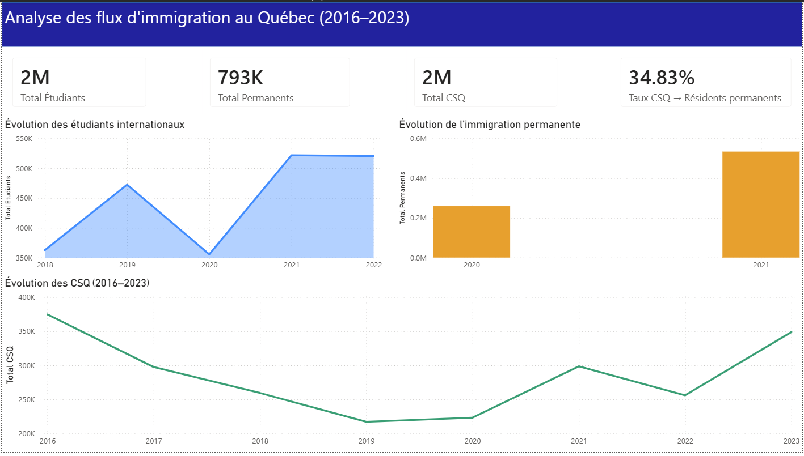
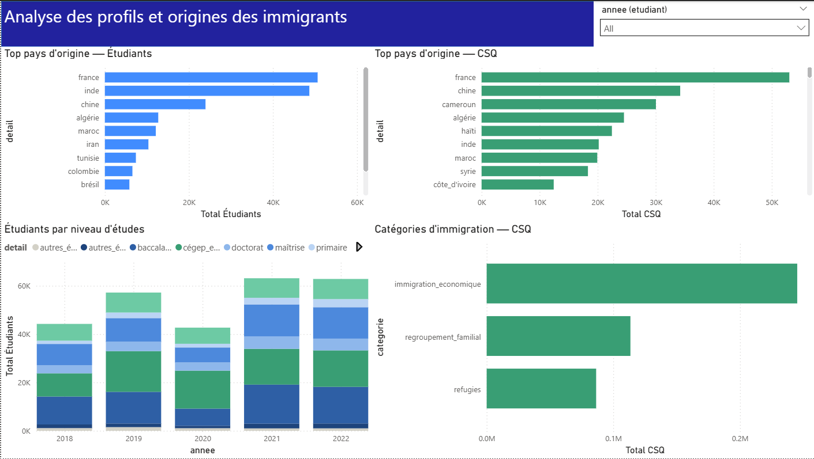
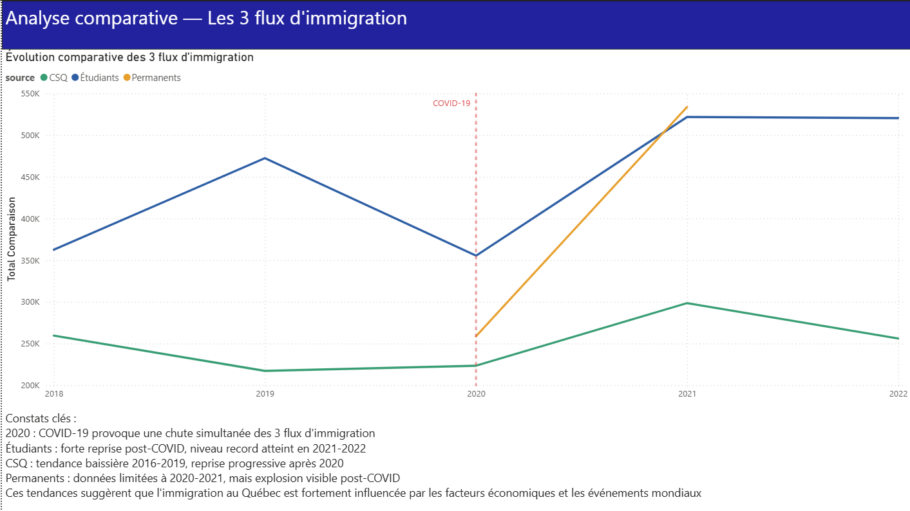

# Projet de synthèse – Analyse des données d'immigration au Québec

## Description du projet

Ce projet vise à développer un **système d’analyse décisionnelle** permettant d’explorer et d’analyser des données ouvertes liées à l’immigration au Québec.

Les données utilisées proviennent principalement du portail **Données Québec** et incluent plusieurs ensembles de données concernant :

- les étudiants internationaux
- les admissions permanentes
- les certificats de sélection du Québec (CSQ)

L’objectif du projet est de transformer ces données brutes en **informations exploitables** à l’aide d’un pipeline complet incluant le nettoyage, le stockage, l’analyse et la visualisation des données.

---

## Objectifs du projet

Les objectifs principaux sont :

- Identifier des jeux de données ouverts liés à l’immigration au Québec
- Nettoyer et préparer les données
- Structurer les données dans une base de données relationnelle
- Réaliser des analyses à l’aide de SQL et Python
- Concevoir un tableau de bord interactif pour visualiser les résultats

---

## Jeux de données utilisés

### Étudiants internationaux – permis d’études (2018–2022)

Contient des informations sur les permis d’études délivrés aux étudiants internationaux au Québec.

Variables principales :

- groupe d’âge
- niveau d’études
- région de destination
- pays de naissance
- langues connues

---

### Admissions permanentes au Québec

Dataset contenant des informations sur les admissions permanentes selon différentes caractéristiques démographiques.

Variables principales :

- groupe d’âge
- région de naissance
- catégorie d’immigration

---

### Certificats de sélection du Québec (CSQ)

Dataset présentant les certificats de sélection délivrés selon différents programmes d’immigration entre **2016 et 2023**.

---

## Technologies utilisées

Le projet utilise plusieurs outils d’analyse de données :

- **Excel** – nettoyage initial des données
- **Python (Pandas)** – nettoyage avancé et automatisation
- **SQL Server** – stockage et requêtes analytiques
- **Power BI** – visualisation des données

---

---

## Tableau de bord Power BI

Un tableau de bord interactif a été développé avec **Power BI** afin de visualiser et analyser les tendances de l’immigration au Québec.

Le dashboard est organisé en **trois pages principales** :

### 1. Vue générale

- Indicateurs clés (KPI) :
  - Total des étudiants internationaux
  - Total des résidents permanents
  - Total des certificats de sélection du Québec (CSQ)
  - Taux de conversion (CSQ → résidents permanents)
- Évolution des étudiants internationaux (2018–2022)
- Évolution de l’immigration permanente (2020–2021)
- Évolution des CSQ (2016–2023)



---

### 2. Profils et origines

- Top pays d’origine des étudiants internationaux
- Top pays d’origine des bénéficiaires du CSQ
- Répartition des étudiants par niveau d’études
- Catégories d’immigration (CSQ)



---

### 3. Analyse comparative

- Comparaison des trois flux d’immigration :
  - Étudiants internationaux
  - Résidents permanents
  - CSQ
- Identification des tendances globales
- Impact de la COVID-19 sur les flux migratoires



---

### Remarque technique

Le fichier Power BI (`.pbix`) est configuré en **mode Import**, ce qui signifie que les données sont intégrées directement dans le fichier et ne nécessitent pas de connexion à SQL Server pour être consultées.

---

## Structure du projet

```
PROJET_SYNTHESE/
│
├── Data/
│ ├── raw/ # données brutes
│ ├── clean/ # données nettoyées (Excel)
│ └── processed/ # données finales (Python)
│
├── docs/
│ ├── data_cleaning_excel.md
│ ├── data_cleaning_python.md
│ └── data_sources.md
│
├── scripts/
│ ├── clean_all_data.py
│ └── check_data.py
│
├── sql/
│ ├── 01_create_database.sql
│ ├── 02_create_tables.sql
│ └── 03_analysis_queries.sql
│
├── figures/ # captures du dashboard Power BI
│
└── README.md
```

---

## Étapes du projet

Le projet est organisé selon les étapes suivantes :

1. Exploration des données
2. Nettoyage initial des données (Excel)
3. Nettoyage avancé et automatisation (Python)
4. Conception de la base de données (SQL Server)
5. Analyse des données
6. Création du tableau de bord (Power BI)
7. Rédaction du rapport final

---

## Résultats attendus

À la fin du projet, le système permettra :

- d’explorer les tendances liées aux étudiants internationaux
- d’analyser les admissions permanentes
- d’étudier l’évolution des programmes d’immigration au Québec
- de visualiser ces informations dans un tableau de bord interactif

---
 **Accéder au site :**  
[https://brabra6.github.io/immigration-web-dashboard/](https://brabra6.github.io/immigration-web-dashboard/)

 **Note :** Le site web n’est pas encore finalisé et certaines fonctionnalités ou visualisations peuvent être incomplètes.

## Auteur

**Brahim Landing Thiam**  
Baccalauréat en informatique  
Université du Québec en Outaouais
